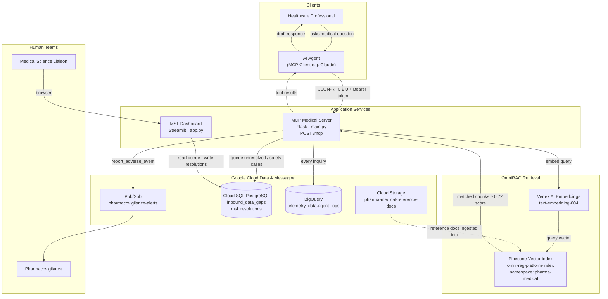
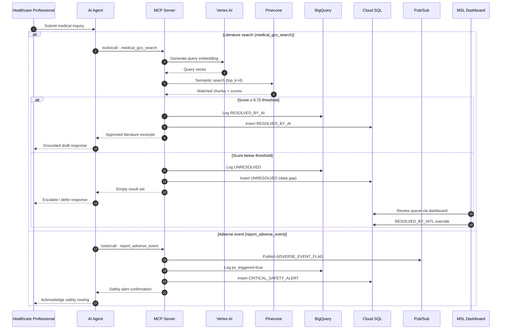
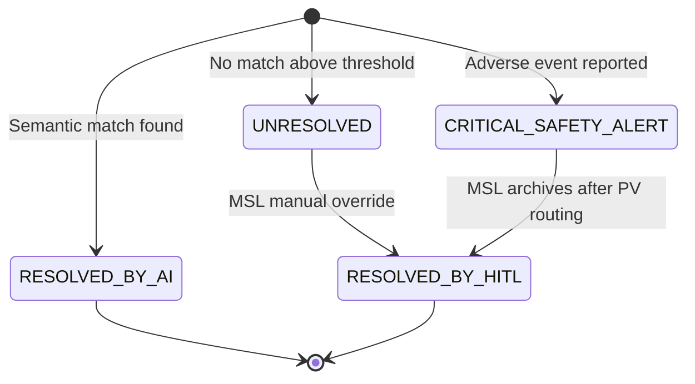
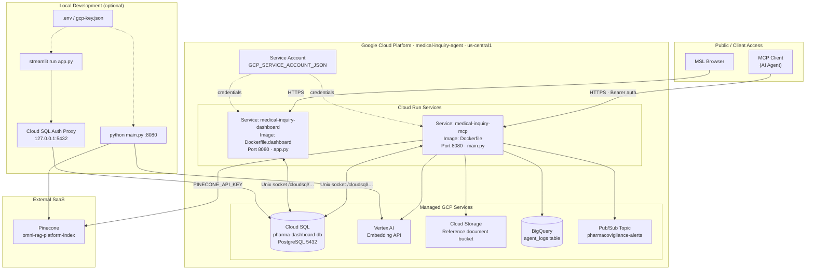
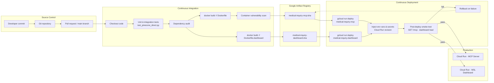
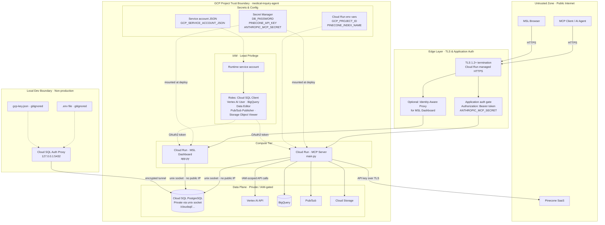

# Medical Inquiry Agent

An AI-assisted medical affairs platform for handling healthcare professional (HCP) inquiries about pharmaceutical products. The system combines semantic search over approved reference literature, automated pharmacovigilance routing, and a human-in-the-loop dashboard for Medical Science Liaisons (MSLs).

Built for regulated environments where answers must be grounded in approved documentation, adverse events must be escalated immediately, and every interaction requires an audit trail.

## Overview

When an HCP asks a question—through an AI agent connected via MCP—the system:

1. **Searches approved literature** using semantic vector retrieval (OmniRAG over Pinecone + Vertex AI embeddings)
2. **Flags adverse events** and publishes safety alerts to Google Pub/Sub for pharmacovigilance teams
3. **Logs every transaction** to BigQuery and Cloud SQL for compliance and review
4. **Surfaces unresolved cases** in a Streamlit dashboard where MSLs can resolve data gaps manually

## Architecture

### System Architecture

High-level view of components, integrations, and data paths across the platform.



### Inquiry Flow

End-to-end sequence for a literature search and an adverse-event escalation.



### Inquiry Status State Machine



### Deployment Architecture

How services are containerized and deployed across GCP and external providers.



**Production topology notes:**

| Component | Deploy target | Connection |
|-----------|---------------|------------|
| MCP Server | Cloud Run (`Dockerfile`) | Cloud SQL via `/cloudsql` socket; Pinecone over HTTPS |
| MSL Dashboard | Cloud Run (`Dockerfile.dashboard`) | Cloud SQL via `/cloudsql` socket |
| Reference docs | GCS bucket → Pinecone index | Ingested outside the request path |
| Audit telemetry | BigQuery + Cloud SQL | Written on every MCP tool call |
| PV alerts | Pub/Sub | Triggered by `report_adverse_event` |

### CI/CD Pipeline

Recommended build-and-deploy pipeline for the two Cloud Run services. The repository includes a starter workflow at [`.github/workflows/deploy.yml`](.github/workflows/deploy.yml).



**Pipeline stages:**

| Stage | Action | Artifact / outcome |
|-------|--------|-------------------|
| Build | `docker build` from `mcp-medical-server/` | Two container images (MCP + dashboard) |
| Publish | Push to Artifact Registry | Immutable image tags per commit SHA |
| Deploy | `gcloud run deploy` with Cloud SQL connector | New Cloud Run revisions in `us-central1` |
| Verify | Hit `GET /mcp` with bearer token; load Streamlit UI | Confirms auth, DB socket, and external API reachability |
| Promote | Tag `:latest` or environment-specific tag after smoke pass | Stable rollback pointer |

**Suggested automation:** GitHub Actions or Cloud Build triggered on merge to `main`, with secrets sourced from GCP Secret Manager rather than committed `.env` files.

#### GitHub Actions setup

The [`deploy.yml`](.github/workflows/deploy.yml) workflow runs on every pull request (CI only) and on merges to `main` (full build → deploy → smoke test → rollback on failure).

**One-time GCP prerequisites:**

1. Create an Artifact Registry repository: `medical-inquiry-agent` in `us-central1`
2. Create Secret Manager secrets (names must match the workflow):
   - `PINECONE_API_KEY`
   - `DB_PASSWORD`
   - `ANTHROPIC_MCP_SECRET`
   - `GCP_SERVICE_ACCOUNT_JSON` (runtime service account key for the MCP server)
3. Grant the deploy service account:
   - `roles/run.admin`, `roles/artifactregistry.writer`, `roles/secretmanager.secretAccessor`
   - `roles/cloudsql.client` (Cloud SQL connector on Cloud Run)
4. Configure [Workload Identity Federation](https://github.com/google-github-actions/auth#setting-up-workload-identity-federation) between GitHub and GCP

**Required GitHub repository secrets:**

| Secret | Purpose |
|--------|---------|
| `GCP_WORKLOAD_IDENTITY_PROVIDER` | WIF provider resource name |
| `GCP_SERVICE_ACCOUNT_EMAIL` | Deploy service account email |
| `ANTHROPIC_MCP_SECRET` | Bearer token used by the post-deploy MCP smoke test |

**Workflow behavior:**

| Trigger | Jobs |
|---------|------|
| Pull request → `main` | `test` — compile sources + dependency audit |
| Push → `main` | `test` → `build-and-deploy` — push images, deploy both Cloud Run services, smoke test, rollback on failure |
| Manual (`workflow_dispatch`) | Same as push to `main` |

Override defaults (project ID, region, service names) via the `env` block at the top of `deploy.yml`.

### Network & Security Boundaries

Trust zones, authentication layers, and how secrets flow into runtime services.



**Security controls mapped to code:**

| Control | Implementation | Location |
|---------|----------------|----------|
| MCP endpoint auth | Bearer token validated on every request | `verify_security_passkey()` in `main.py` |
| GCP identity | Service account JSON, `gcp-key.json`, or Application Default Credentials | `main.py` startup |
| Database access | Cloud SQL unix socket in Cloud Run; proxy locally | `get_db_connection()` in `main.py` / `app.py` |
| Retrieval safety | Cosine similarity threshold ≥ 0.72 | `search_omnirag_vector_matrix()` |
| Secret hygiene | `.env`, `gcp-key.json` gitignored | `.gitignore` |
| Audit immutability | Every tool call logged to BigQuery + Cloud SQL | `log_transaction_to_bigquery()`, DB inserts |

**Network posture notes:**

- Cloud Run services accept inbound HTTPS only; Cloud SQL is not exposed on a public IP when using the Cloud SQL connector.
- Pinecone is the only external data-plane dependency outside GCP; traffic is outbound HTTPS with an API key.
- Production secrets should live in **Secret Manager** and be referenced by Cloud Run at deploy time—not baked into images or committed to Git.
- Consider **Identity-Aware Proxy (IAP)** on the Streamlit dashboard so only authenticated MSL staff reach the operational workbench.

## Features

### MCP Server (`mcp-medical-server/main.py`)

Exposes two tools to connected AI agents:

| Tool | Purpose |
|------|---------|
| `medical_gcs_search` | Semantic search over approved medical reference documents stored in Pinecone |
| `report_adverse_event` | Escalates suspected adverse events to pharmacovigilance via Pub/Sub |

**Safety guardrails:**
- Vector similarity threshold (0.72 cosine score) prevents low-confidence answers from being returned
- Unresolved queries are logged as data gaps for human review
- Bearer token authentication protects the MCP endpoint

### MSL Dashboard (`mcp-medical-server/app.py`)

A Streamlit application for the medical affairs team:

- **Active Action Queue** — Outstanding data gaps and critical safety alerts requiring attention
- **Full Historical Audit Log** — Immutable record of all inquiries and resolutions
- **Manual Override Workbench** — MSLs can paste verified reference literature and approve compliant responses for unresolved inquiries

### Reference Documentation

Sample approved product literature lives in `Reference docs/` (e.g., Dupixent, Xenotrin). These documents are intended to be ingested into the Pinecone vector index for retrieval.

## Tech Stack

| Layer | Technology |
|-------|------------|
| MCP Protocol | JSON-RPC 2.0 over HTTP (Flask) |
| Vector Search | Pinecone + LlamaIndex |
| Embeddings | Google Vertex AI (`text-embedding-004`) |
| Storage | Google Cloud Storage |
| Messaging | Google Cloud Pub/Sub |
| Analytics | Google BigQuery |
| Database | Cloud SQL (PostgreSQL) |
| Dashboard | Streamlit |
| Deployment | Docker → Google Cloud Run |

## Project Structure

```
.
├── mcp-medical-server/
│   ├── main.py                  # MCP server (Flask)
│   ├── app.py                   # MSL dashboard (Streamlit)
│   ├── requirements.txt         # MCP server dependencies
│   ├── requirements-dashboard.txt
│   ├── Dockerfile               # MCP server container
│   ├── Dockerfile.dashboard     # Dashboard container
│   ├── print_my_vector.py       # Vector debugging utility
│   └── test_pinecone_direct.py  # Pinecone connectivity test
├── Reference docs/              # Approved product reference literature
├── .github/workflows/
│   └── deploy.yml               # CI/CD: build, deploy, smoke test
├── .env.example                 # Environment variable template
└── README.md
```

## Getting Started

### Prerequisites

- Python 3.11+
- Google Cloud project with Vertex AI, Cloud SQL, BigQuery, Pub/Sub, and Cloud Storage enabled
- Pinecone account with an index populated from your reference documents
- (Optional) Cloud SQL Auth Proxy for local database access

### Environment Variables

Copy `.env.example` to `.env` and configure:

```bash
cp .env.example .env
```

| Variable | Description |
|----------|-------------|
| `PINECONE_API_KEY` | Pinecone API key |
| `PINECONE_INDEX_NAME` | Vector index name (default: `omni-rag-platform-index`) |
| `GOOGLE_CLOUD_PROJECT` | GCP project ID |
| `GCP_PROJECT_ID` | Same as above (used by server) |
| `GCP_SERVICE_ACCOUNT_JSON` | Service account credentials (JSON or base64-encoded) |
| `GCS_BUCKET_NAME` | GCS bucket for reference documents |
| `GCP_PUBSUB_TOPIC` | Pub/Sub topic for pharmacovigilance alerts |
| `ANTHROPIC_MCP_SECRET` | Bearer token for MCP endpoint authentication |
| `DB_PASSWORD` | Cloud SQL PostgreSQL password |
| `EMBED_MODEL_NAME` | Vertex embedding model (default: `text-embedding-004`) |

For local development, you can also place a `gcp-key.json` service account file in the project root (this path is gitignored).

### Run the MCP Server Locally

```bash
cd mcp-medical-server
pip install -r requirements.txt
python main.py
```

The server listens on port `8080` by default. Connect your MCP client to:

```
http://localhost:8080/mcp
```

Include the bearer token in requests:

```
Authorization: Bearer <ANTHROPIC_MCP_SECRET>
```

### Run the Dashboard Locally

Requires a running Cloud SQL Auth Proxy or direct network access to the database:

```bash
cd mcp-medical-server
pip install -r requirements-dashboard.txt
streamlit run app.py
```

### Docker Deployment

**MCP Server:**

```bash
cd mcp-medical-server
docker build -t medical-inquiry-mcp .
docker run -p 8080:8080 --env-file ../.env medical-inquiry-mcp
```

**Dashboard:**

```bash
cd mcp-medical-server
docker build -f Dockerfile.dashboard -t medical-inquiry-dashboard .
docker run -p 8080:8080 medical-inquiry-dashboard
```

Both services are designed to run on Google Cloud Run with Cloud SQL socket connections.

## MCP Tools Reference

### `medical_gcs_search`

Searches approved medical literature using semantic vector retrieval.

**Input:**
```json
{
  "query": "What is the approved adult dosage for Xenotrin?"
}
```

**Output:** JSON array of matched document chunks with source file names and excerpt text. Returns an empty array if no chunks meet the similarity threshold.

### `report_adverse_event`

Flags a suspected adverse event for pharmacovigilance review.

**Input:**
```json
{
  "drug_name": "Xenotrin",
  "raw_inquiry_text": "Patient reported severe nausea after starting Xenotrin 10mg.",
  "detected_symptoms": ["nausea"]
}
```

**Output:** Confirmation with a Pub/Sub message ID. The inquiry is logged as `CRITICAL_SAFETY_ALERT` in the database.

## Inquiry Status Flow

| Status | Meaning |
|--------|---------|
| `RESOLVED_BY_AI` | Semantic search returned matching approved literature |
| `UNRESOLVED` | No sufficiently confident match; queued for MSL review |
| `CRITICAL_SAFETY_ALERT` | Adverse event detected; routed to pharmacovigilance |
| `RESOLVED_BY_HITL` | Manually resolved by an MSL via the dashboard |

## Security Notes

- Never commit `.env`, `gcp-key.json`, or other credential files
- The MCP endpoint requires bearer token authentication
- Adverse event cases are locked in the dashboard—MSLs cannot modify safety alerts, only archive them after PV routing
- All AI-generated responses should be reviewed against approved labeling before dispatch to HCPs

## License

No license file is included. Add one before distributing or open-sourcing this project.
